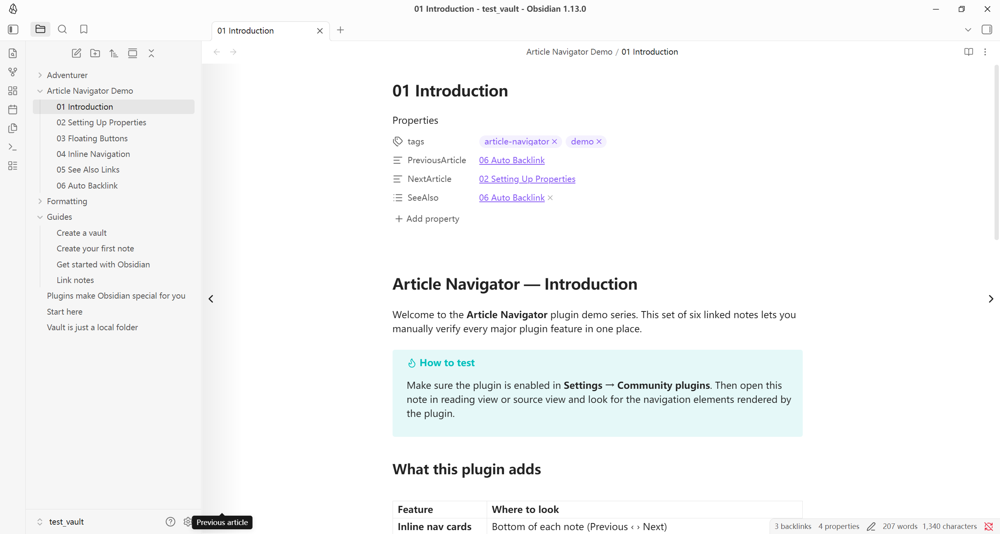
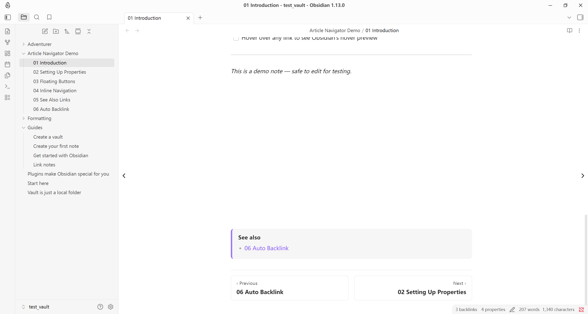
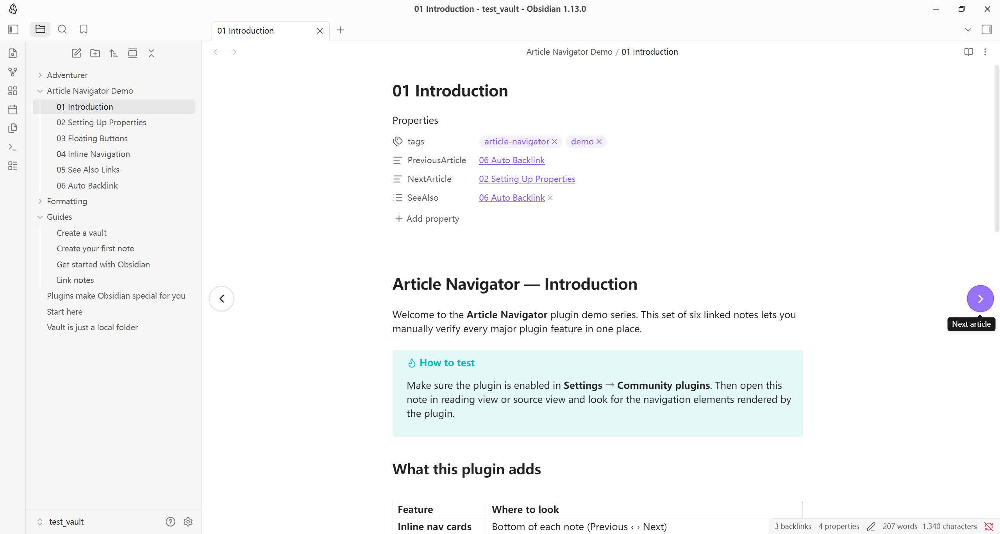

# Article Navigator

> An [Obsidian](https://obsidian.md) community plugin · [中文文档](README_zh.md)

Adds **Previous / Next / See Also** navigation to your notes through standard frontmatter properties. Supports a VitePress-style inline nav bar, floating side buttons, and automatic reverse linking — all without any external dependencies.

---

## Features

| Feature | Description |
|---|---|
| **Inline navigation** | Previous / Next cards rendered at the bottom of each note (Reading & Source view) |
| **Floating side buttons** | Circular or full-height strip buttons inside the document area |
| **See Also list** | Related-note list rendered at the top or bottom of a note |
| **Auto backlink** | When you set Prev/Next, the plugin keeps the reciprocal link on the target note in sync |
| **New-note seeding** | Newly created empty notes get the three navigation properties automatically |
| **Edge / tap navigation** | Optional: double-click page margins or tap half the screen on mobile to navigate |
| **i18n** | UI language follows Obsidian's language setting automatically |

---

## Demo







---

## Installation

Make sure you have turned off **Restricted mode** in **Settings → Community plugins** to allow using plugins.

### Via Obsidian URI

1. click this link: [obsidian://show-plugin?id=article-navigator](obsidian://show-plugin?id=article-navigator) to open the plugin page in Obsidian's Community plugin browser.
2. Click **Install**, then **Enable**.

### Community plugin browser

1. Open **Settings → Community plugins → Browse**.
2. Search for **Article Navigator**.
3. Click **Install**, then **Enable**.

### Manual installation

1. Download `main.js`, `manifest.json`, and `styles.css` from the [latest release](../../releases/latest).
2. Copy the three files to `<vault>/.obsidian/plugins/article-navigator/`.
3. Reload Obsidian and enable the plugin in **Settings → Community plugins**.

---

## Getting started

### 1 · Add navigation properties to a note

Open any note and run the command:

> **Article Navigator: Insert navigation properties into current note**

This inserts three empty frontmatter keys if they are not already present:

```yaml
---
PreviousArticle: ""
NextArticle: ""
SeeAlso: []
---
```

### 2 · Link to adjacent notes

Fill in the keys with wikilinks:

```yaml
PreviousArticle: "[[My Previous Note]]"
NextArticle: "[[My Next Note]]"
SeeAlso:
  - "[[Related Topic A]]"
  - "[[Related Topic B]]"
```

### 3 · Navigate

- Click the **inline nav cards** at the bottom of the note.
- Click the **floating side buttons** at the document edges.
- Use the commands **Go to previous article** / **Go to next article** (assignable to hotkeys).

---

## Settings reference

### Display

| Setting | Default | Description |
|---|---|---|
| Add properties to new notes | On | Seed empty new notes with the three navigation keys |
| Inline navigation at bottom | On | Show the VitePress-style Previous / Next bar |
| Floating side buttons | Tall | Style of the floating buttons: `Off`, `Circular`, `Tall strip` |
| See Also position | Bottom | Where to render the See Also block: `Top`, `Bottom`, `Hidden` |

### Floating button behaviour

| Setting | Default | Description |
|---|---|---|
| Fade buttons when idle | On | Fade to 12 % opacity after the delay |
| Idle fade delay | 3 s | Seconds of inactivity before fading (1–15) |

### Tap navigation

| Setting | Default | Description |
|---|---|---|
| Double-click margins to navigate | Off | Double-click the empty area beside the content |
| Tap half-screen on mobile | Off | Single tap on the left / right half navigates |

### Auto reverse linking

| Setting | Default | Description |
|---|---|---|
| Enable auto reverse linking | On | Keep reciprocal Prev/Next links in sync automatically |
| Conflict mode | Prompt | What to do when the target already has a different link: `Prompt`, `Auto-update`, `Skip` |

### Property keys

Override the frontmatter key names. Changes apply only to new links — existing notes using old keys are not migrated automatically.

| Setting | Default |
|---|---|
| Previous article key | `PreviousArticle` |
| Next article key | `NextArticle` |
| See Also key | `SeeAlso` |

### Display labels

Leave blank to use the default label for Obsidian's current language.

| Setting | Default (English) | Default (Chinese) |
|---|---|---|
| Previous label | Previous | 上一篇 |
| Next label | Next | 下一篇 |
| See Also label | See also | 相关阅读 |

---

## Commands

| Command | Description |
|---|---|
| Go to previous article | Navigate to the note in `PreviousArticle` |
| Go to next article | Navigate to the note in `NextArticle` |
| Insert navigation properties | Add empty Prev / Next / SeeAlso keys to the active note |

All three commands can be assigned to custom hotkeys in **Settings → Hotkeys**.

---

## Development

### Requirements

- Node.js ≥ 18 (LTS recommended)
- npm

### Setup

```bash
git clone https://github.com/IvanHanloth/obsidian-article-navigator
cd obsidian-article-navigator
npm install
```

### Scripts

| Command | Description |
|---|---|
| `npm run dev` | Watch mode — rebuilds `main.js` on every change |
| `npm run build` | Type-check + production bundle |
| `npm run deploy` | Build and copy artifacts into `test_vault` |
| `npm run deploy -- /path/to/vault` | Build and deploy to a custom vault |
| `npm run lint` | ESLint (includes Obsidian-specific rules) |
| `npm run version` | Bump version in `manifest.json` and `versions.json` |

> **Tip:** You can also set the target vault via an environment variable:
> ```bash
> VAULT_PATH=/path/to/my-vault npm run deploy
> ```

### Project layout

```
src/
├── main.ts                 Plugin lifecycle — event wiring, onload / onunload
├── types.ts                Shared TypeScript types
├── constants.ts            CSS class names, timer durations
├── settings.ts             Settings interface, defaults, migration
├── settings-tab.ts         Settings UI
├── commands.ts             Command registration
├── i18n/
│   ├── index.ts            I18n class, locale detection
│   └── locales/
│       ├── en.ts           English
│       └── zh.ts           Chinese
├── nav/
│   ├── link-resolver.ts    Frontmatter link parsing and resolution
│   ├── frontmatter.ts      Frontmatter read / write helpers
│   └── auto-backlink.ts    Reciprocal link automation
└── ui/
    ├── view-manager.ts     Per-view refresh orchestration
    ├── floating-buttons.ts Floating prev / next buttons
    ├── inline-injections.ts Inline nav bar + See Also block
    ├── edge-handlers.ts    Edge / mobile tap handlers
    └── confirm-modal.ts    Confirmation dialog
```

### Adding a locale

1. Create `src/i18n/locales/<code>.ts` implementing the `Translation` interface from `src/i18n/index.ts`.
2. Import and register it in the `BUNDLES` map in `src/i18n/index.ts`.
3. Add the locale code to the `LocaleCode` union type.

---

## Releasing

1. Update `minAppVersion` in `manifest.json` if needed (see the [Obsidian version reference](https://docs.obsidian.md/Reference/Versions)).
2. Run `npm version patch|minor|major` — this bumps `manifest.json`, `package.json`, and `versions.json`.
3. Push the tag and create a GitHub release with `main.js`, `manifest.json`, and `styles.css` as release assets.

---

## Compatibility

- **Minimum Obsidian version:** 1.4.0
- **Mobile:** ✓ fully supported (`isDesktopOnly: false`)
- No external network requests, no telemetry.

---

## License

MIT License
